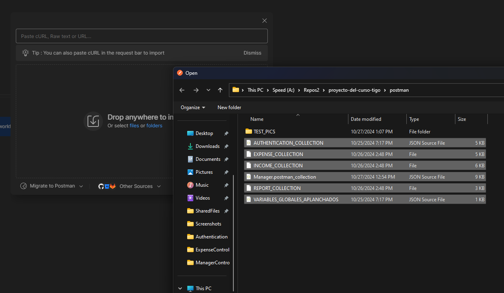

# Instrucciones de ejecución de colecciones de Postman 

Dado que los controladores son de tipo REST, se pueden probar fácilmente con Postman. Para ello, se proporcionan las colecciones de Postman en el directorio `postman` del proyecto.

## Importar colecciones

Para importar las colecciones de Postman, se debe seguir los siguientes pasos:

1. Abrir Postman.

2. Hacer clic en el botón `Import` en la esquina superior izquierda.

3. Arrasrar y soltar las colecciones que se encuentran en el directorio `postman` del proyecto.

Deberias ver algo como esto:

## Ejecutar colecciones

Para ejecutar las colecciones de Postman, primero asegurate que en los entornos de postman este seleccionado el entorno 'variables' que se encuentra en el directorio `postman` del proyecto.

Luego, selecciona la colección que deseas ejecutar, clic derecho y selecciona `Run Collection`.

Selecciona el numero de iteraciones y clic en `Run`. Veras algo como esto:

Repite el proceso para las demás colecciones. Tambien puedes ejecutar los test de las colecciones de forma individual. Como se muestra en el video localizado en el directorio `doc` del proyecto titulado `POSTMAN_COLLECTIONS_WORKING`.